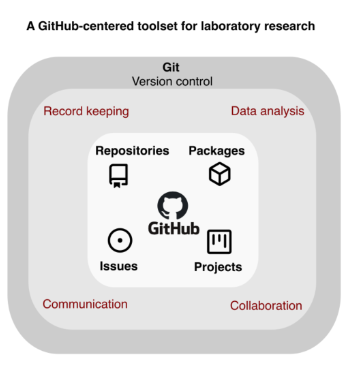

# ELN and GitHub

## Lets think about....

::: callout-note
## What should we value an ELN?
:::

- Easy-to-archive

- Easy read and Easy write

- Flexibility --- We all have different way to handle our missions!

. . .

::: callout-note
## What should we pursue as a researcher?
:::

- Reproducibility -- ex. Documentation

- Collaborative -- ex. Data share to other researcher

- Robust workflow

. . .

::: callout-caution
## Caution

We are vulnerable, fragile but busy
:::

## What we have been using

**1. Google Docs, Dropbox and OpenBis**

**(a.k.a Cloud-based tools)**

::: callout-tip
## **Good**

- Easy to share
- Intuitive (User friendly)
- Globally used
:::

::: callout-warning
## **Lack of**

- Structured way to track change (version control)
:::

\

. . .

**2. Slack, Microsoft Teams**

**(a.k.a Messaging tools)**

::: callout-tip
## Good

- Facilitate informal discussion
- Easy for file exchange
:::

::: callout-warning
## Lack of

- poor organized format
- unreproducible
:::

## Fragmented research tool {transition="convex"}

{fig-align="center"}

::: {style="font-size: 0.4em; text-align: center; color: gray;"}
Chen, K. Y., Toro-Moreno, M., & Subramaniam, A. R. (2024). GitHub is an effective platform for collaborative and reproducible laboratory research. arXiv. https://arxiv.org/abs/2408.09344
:::

## Here is Git and GitHub!

### This is All-in-one package

- version tracking

- Universal file formats

- Collaboration

- etc...

::: callout-warning
## However

We need a bit of time to learn....
:::

## Here is Git and GitHub!
### This is All-in-one package
{fig-align="center"}

::: {style="font-size: 0.4em; text-align: center; color: gray;"}
Chen, K. Y., Toro-Moreno, M., & Subramaniam, A. R. (2024). GitHub is an effective platform for collaborative and reproducible laboratory research. arXiv. https://arxiv.org/abs/2408.09344
:::

# What? and How?

## What's Git

::: {.hl-purple}
Git is a record system within your folder
{height="1.2em" style="vertical-align: middle; display: inline;"}
:::

: Once you have a change **wherever** in your file, git will record.

\

::: {.fragment}

### What's GitHub

::: {.hl-blue}
GitHub is a web-based code cloud
{height="1.2em" style="vertical-align: middle; display: inline;"} 
:::

: Once you have done your job, you can **upload** your code/files to GitHub, so others can access it.

:::

## So How?? 

::: callout-note
## OKay! i know what they are!

But HOW?
:::

1.  Setup GitHub down arrow (plz help me to add)
2.  Create own repository down arrow (plz help me to add)
3.  clone to local down arrow (plz help me to add)
4.  Edit files down arrow (plz help me to add)
5.  stage and commit changes down arrow (plz help me to add)

::: callout-important
## Important

During Whole process what you need to command are: - git init - git add . - git commit -m “\[descriptive message\]” - git log

- git remote add origin \[url\]
- git push origin \[branch\]
:::

::: {.columns}
:::: {.column width="50%"}
- Data collection
- Statistical analysis
::::
:::: {.column width="50%"}

::::
:::

# Markdown

# Data management with Claude Code