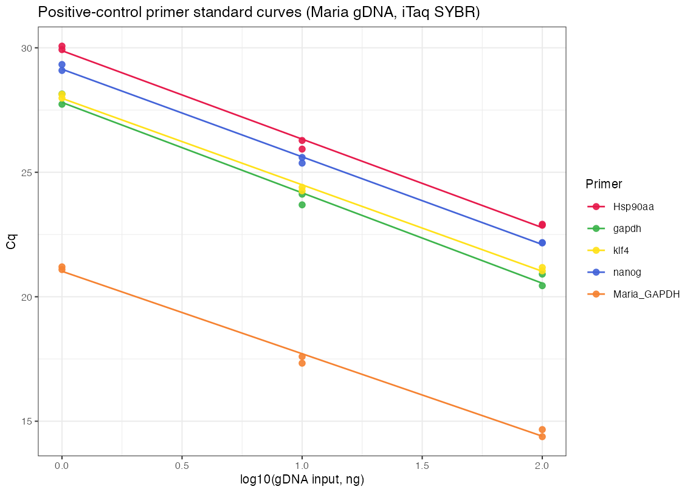

---
format:
  html:
    embed-resources: true
---

# Positive-control primer efficiency — four housekeeping/pluripotency pairs (Maria gDNA, iTaq SYBR)

## Aim

Establish a panel of well-behaved **positive-control primers** for the RoCK-ATAC qPCR workflow — primer pairs that amplify a single specific product at **≥90% efficiency** on clean template, to serve as reaction/plate anchors alongside Maria's validated GAPDH pair. Four candidates spanning constitutive housekeeping and pluripotency loci are titrated here: **Hsp90aa**, **gapdh**, **klf4**, **nanog**. Maria_GAPDH is run on the same plate as the established reference PC (100% anchor).

## Protocol

- Conditions: n = 2 technical replicates per target per input level; three-point titration **1 / 10 / 100 ng** (log₁₀ 0/1/2).
- Targets (5): **Hsp90aa**, **gapdh**, **klf4**, **nanog** (candidate PCs) and **Maria_GAPDH** (reference PC).
- Template: **Maria's gDNA** (the clean, ≥90%-efficient reference established on 2026-07-09).
- **Chemistry:** **\*PowerUp SYBR Green Master Mix (2×)**, 20 µL reactions — 2 µL template + 2 µL primer + 10 µL 2× iTaQ qpCR mix + 6 µL water. CFX protocol `qRT_PCR_template_GAPDH.prcl`, plate `20260713.pltd`; run 2026-07-16, 12:31–15:26 UTC, instrument 782BR21735.
- **Plate layout.** Rows set gDNA input (A/B/C = 1/10/100 ng), two wells per target (technical duplicate). Candidate PCs in cols 1–2/4–5/7–8/10–11 of rows A–C; Maria_GAPDH block in rows E–G.

| Input (row) | Col 1–2 | Col 4–5 | Col 7–8 | Col 10–11 |
| ----------- | ------- | ------- | ------- | --------- |
| 1 ng (A)    | Hsp90aa | gapdh   | klf4    | nanog     |
| 10 ng (B)   | Hsp90aa | gapdh   | klf4    | nanog     |
| 100 ng (C)  | Hsp90aa | gapdh   | klf4    | nanog     |

Reference PC (rows E/F/G = 1/10/100 ng), cols 1–2: **Maria_GAPDH**.

**No no-template control (NTC) was included on this plate** — see Discussion.

**Readout.** CFX Maestro Cq export + melt. Standard curve fitted per target as Cq vs log₁₀(input); efficiency E = 10^(−1/slope) − 1.

## Results

- **All four candidate primers pass.** Efficiencies span **88.5–94.0%**, all curves tightly linear (R² 0.99–1.00), tight technical duplicates (Cq SD ≤ 0.33), and each target gives a single distinct melt peak.
- **klf4 (94.0%)** and **nanog (92.3%)** are the strongest; **Hsp90aa (91.2%)** is solid; **gapdh (88.5%)** is marginally below the 90% line but well within usable range.
- The **Maria_GAPDH reference read 100.4%** on this plate — confirming the run, chemistry, and gDNA titration are clean, and validating the absolute efficiencies (the 2026-07-09 plate had run ~87% at the anchor; this plate does not carry that systematic loss).
- Maria_GAPDH sits ~6–9 Cq earlier than the candidates at matched input, consistent with it being a high-copy/multi-mapping locus; the candidates' Cq are appropriate for single-copy genomic targets.

**Standard curves — Cq vs log₁₀ gDNA input**

**Amplification efficiency** (linear fit Cq vs log₁₀ input):

| Target            | slope  | R²    | Efficiency | Melt Tm |
| ----------------- | ------ | ----- | ---------- | ------- |
| klf4              | −3.473 | 0.998 | **94.0%**  | 76.7 °C |
| nanog             | −3.521 | 0.998 | **92.3%**  | 85.3 °C |
| Hsp90aa           | −3.553 | 0.996 | **91.2%**  | 82.3 °C |
| gapdh             | −3.631 | 0.991 | **88.5%**  | 81.3 °C |
| Maria_GAPDH (ref) | −3.312 | 0.994 | **100.4%** | 80.2 °C |

**Cq** (2 technical replicates per target per input; SD = sample standard deviation of the two replicates):

| Target      | Input  | Cq rep1 | Cq rep2 | Mean Cq | Cq SD |
| ----------- | ------ | ------- | ------- | ------- | ----- |
| Hsp90aa     | 1 ng   | 30.07   | 29.93   | 30.00   | 0.10  |
| Hsp90aa     | 10 ng  | 26.28   | 25.93   | 26.10   | 0.25  |
| Hsp90aa     | 100 ng | 22.87   | 22.91   | 22.89   | 0.03  |
| gapdh       | 1 ng   | 28.14   | 27.73   | 27.94   | 0.29  |
| gapdh       | 10 ng  | 24.12   | 23.69   | 23.91   | 0.30  |
| gapdh       | 100 ng | 20.91   | 20.44   | 20.68   | 0.33  |
| klf4        | 1 ng   | 27.98   | 28.13   | 28.05   | 0.11  |
| klf4        | 10 ng  | 24.40   | 24.26   | 24.33   | 0.10  |
| klf4        | 100 ng | 21.04   | 21.18   | 21.11   | 0.09  |
| nanog       | 1 ng   | 29.09   | 29.33   | 29.21   | 0.17  |
| nanog       | 10 ng  | 25.37   | 25.60   | 25.48   | 0.16  |
| nanog       | 100 ng | 22.18   | 22.16   | 22.17   | 0.01  |
| Maria_GAPDH | 1 ng   | 21.09   | 21.20   | 21.15   | 0.08  |
| Maria_GAPDH | 10 ng  | 17.60   | 17.33   | 17.46   | 0.19  |
| Maria_GAPDH | 100 ng | 14.38   | 14.66   | 14.52   | 0.20  |

## Discussion

All four candidate positive-control primers are usable qPCR anchors: efficiencies cluster near the 90% target (88.5–94.0%), standard curves are linear over two orders of magnitude (R² ≥ 0.99), replicate spread is small, and single melt peaks argue against primer-dimer or off-target products. The plate-level anchor, Maria_GAPDH at 100.4%, confirms there is no systematic efficiency loss on this run — a clean contrast to the ~87% anchor seen on 2026-07-09 (which was traced to inhibited WD44 gDNA, not the chemistry). Running on Maria's reference gDNA here removes that confound and gives trustworthy absolute efficiencies.

For panel selection: **klf4** and **nanog** are the top performers and span pluripotency loci; **Hsp90aa** is a strong constitutive housekeeping control. **gapdh** at 88.5% is marginally sub-90% — acceptable as a PC but the weakest of the four; if a single housekeeping anchor is needed, Hsp90aa is preferable.

Caveat: **no NTC** was on this plate, so primer-dimer/contamination cannot be formally excluded — though the clean single melt peaks and linear titrations make a meaningful non-specific contribution unlikely.

**Next steps.** (a) Include an NTC per primer on the next plate to formally close out primer-dimer. (b) Lock the PC panel (recommend klf4 + nanog + Hsp90aa, with Maria_GAPDH as cross-plate anchor) and carry into the ATAC-qPCR quantitation runs. (c) Optionally re-test gapdh with a fresh dilution to see whether it recovers above 90%.

**Conclusion:** All four candidate positive-control primers (Hsp90aa, gapdh, klf4, nanog) amplify efficiently (88.5–94.0%, R² ≥ 0.99) with single melt peaks on clean reference gDNA; klf4, nanog, and Hsp90aa are the strongest and are recommended for the PC panel.
