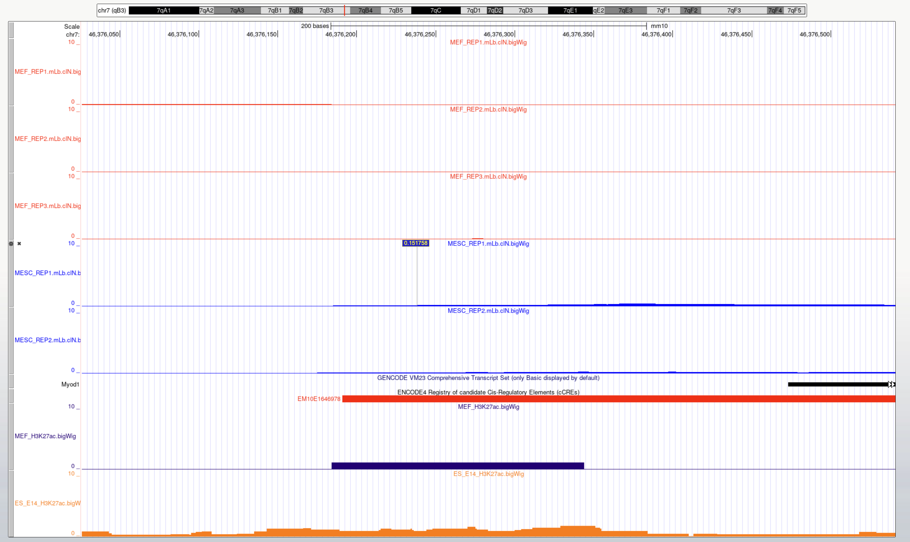
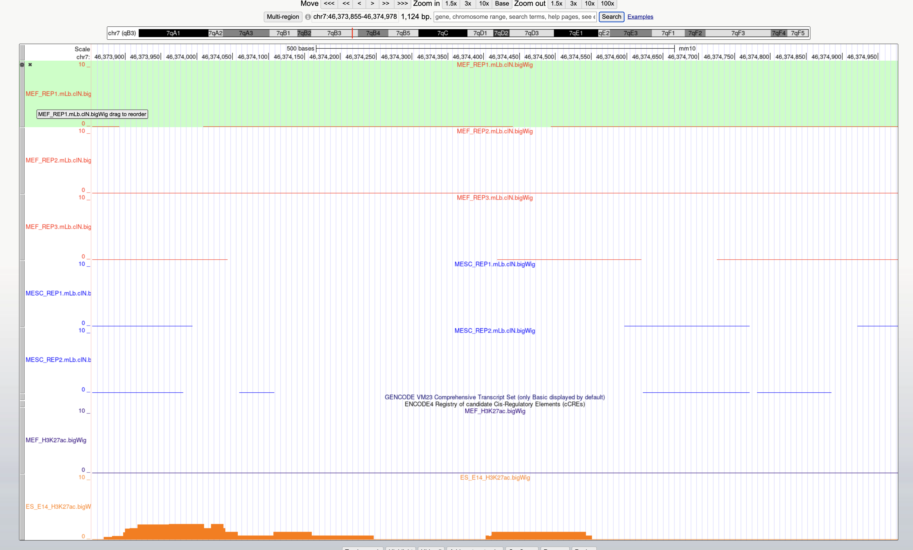
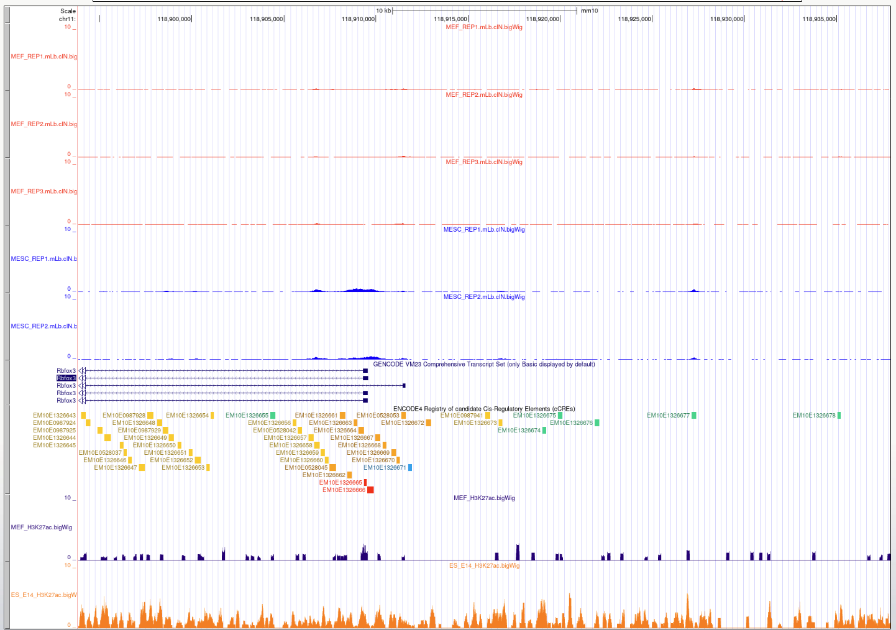
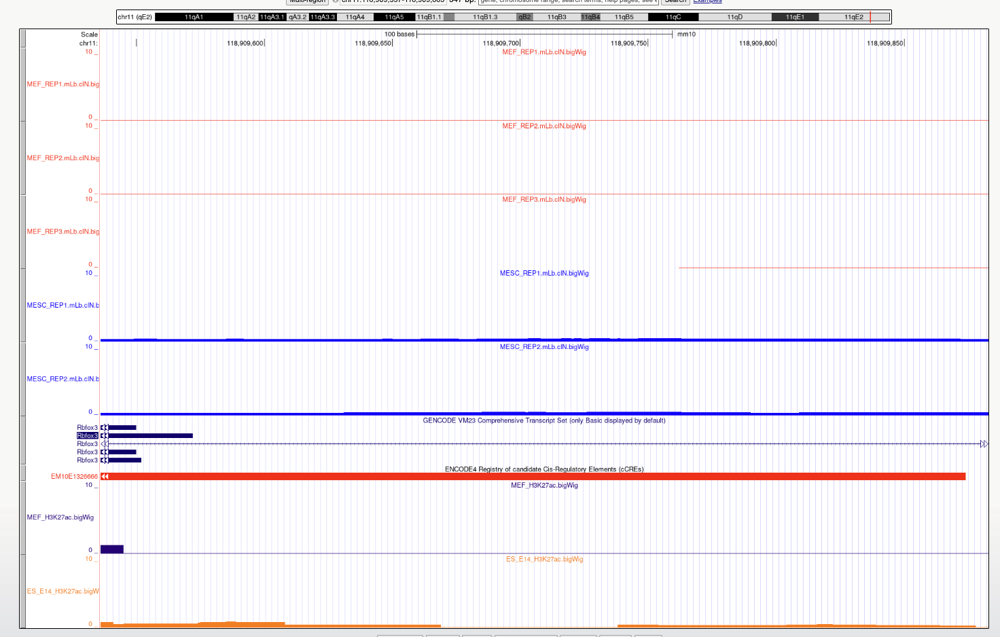
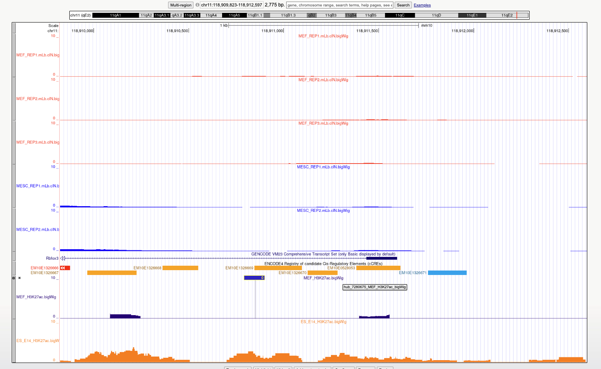

# Double-Negative (Negative Control) Primer Selection — ATAC-qPCR

**Date:** 2026-07-16 \
**Project:** ATAC-qPCR \
**Genome build:** mm10 \
**Cell types:** MEF, mESC \
**Data available:** /Users/yolo/Desktop/Domcke Lab/Master Thesis/Results/cell_type_specific_primer_test/20260716_double_neagtive_primer_selection/NC_primer_selection.md

---

## Goal

Select a **"double-negative"** primer set = a DNA region **not accessible in both MEF and
mESC**. Purpose: a **floor / background control** — confirms the assay gives flat, baseline
signal from closed chromatin

---

## Summery

Promoter + enhancer regions of lineage markers, assumed closed in both fibroblast and stem cell:

- **Myod1** — muscle-cell marker (mm10 chr7). Promoter + Core Enhancer/DRR (~20 kb 5′).
- **Rbfox3 / NeuN** — neuron-cell marker (mm10 chr11). Promoter + nearby up/intronic enhancer.

---

## Note

0. Primer3 setting

- Product Size Ranges (PRIMER_PRODUCT_SIZE_RANGE): 90-120
- Maximum 3' Stability (PRIMER_MAX_END_STABILITY): 7
- Optimal Primer Size (PRIMER_OPT_SIZE): 18
- Minimum Primer Size (PRIMER_MIN_SIZE): 20
- Maximum Primer Size (PRIMER_MAX_SIZE): 23
- Optimal Primer Tm (PRIMER_OPT_TM): 60
- Minimum Primer Tm (PRIMER_MIN_TM): 59
- Maximum Primer Tm (PRIMER_MAX_TM): 61
- Maximum Tm Difference (PRIMER_MAX_DIFF_TM): 2
- Maximum Self Complementarity (PRIMER_SELF_ANY): 4
- Maximum 3' Self Complementarity (PRIMER_SELF_END): 2
- Maximum Poly-X (PRIMER_MAX_POLY_X): 3

1. MyoD_promoter
   > mm10_dna range=chr7:46376017-46376551 5'pad=10 3'pad=10 strand=+ repeatMasking=none
   > TTCTCTGGGTGTGTCATCATTTCTCCACTCTTCTCTAGAACTTTCATTGT
   > CCCGTAGCCTTGAGTCTCTCTCCAAACCTCCTGCAATCTGATTTCTAACT
   > CCTATGCTTTGCCTGGTCTCCAGAGTGGAGTCCGAGGTCAGCTCCGAAGT
   > GAGCACTGAGGTCAGTACAGGCTGGAGGAGTAGACACTGGAGAGGCTTGG
   > GCAGGCTGCACCAGATAGCCAAGTGCTACCGCGTATGGCTGCCAGTCTCT
   > CTGCCCTCCTTCCTAGCTAGGCAGCTGCCCCAGCACAGAGTCGCGGGAGG
   > GGGCACTCCCTGGCCCCAGTGGCTACCCTGGGGACCCCAAGCTCCGCCCT
   > ACTACACTCCTATTGGCTTGAGGCGCCCCCGCCCCCAGCCTCCCTTTCCA
   > GCTCCCGGGCTTTTAGGCTACCCTGGATAAATAGCCCAGGGCGCCTGGCG
   > CGAAGCTAGGGGCCAGGACGCCCCAGGACACGACTGCTTTCTTCACCACT
   > CCTCTGACAGGACAGGACAGGGAGGAGGGGTAGAG

- extended 5' upstream due to better primer selection

F: AACTCCTATGCTTTGCCTGGT

R: TGTCTACTCCTCCAGCCTGT

2. MyoD_promoter_upstream
   > mm10_dna range=chr7:46373855-46374978 5'pad=10 3'pad=10 strand=+ repeatMasking=none
   > TTAAAAGTTTTTATGTACGTGCGTGCTTTGCCCGCATGTAAGTTTGTGAC
   > GCACAAAGGTCAGAGAGGGCATCAGGTCCCTAGAGCTGGGGTTACAGGAA
   > GTTGTGAACAACCATGCAGGCACTGGGAATCAAACCCAGGCCCTCTGCAA
   > GAGCAGTGGGTGCCCTTAACTGTTGAGCCATCTCACCTCTCCGAGCCCAC
   > CCAACCCCATCTTGAGAGCATACCTGCAACTGAACTACTTCTCACCAGAT
   > TCTCTTTGCCTCCCAATGCTAAACAACCATCTGAGTGGCCATGAGCACCC
   > ATTTGGACTGTGGCAGTGCCCTCCAAATGGATCACCTTTCTGTCCTTACC
   > TTCCACGTACCTGTAAAATCCCAAGCTGAGACCTGATACAGCCAATCCTA
   > GGGCAAGTTCAGGAAAGAGGACTAAAGCTGAGAGCAGCGAGATAACTCTG
   > AGGCTGAATCCCTGTTTAGTGTTACAGGAAGAGGAGAAAGAGGGGGAAGA
   > AGAAGAGGAGGAGGGGGGAGGAGGAGGAGAACTGGAAGAAAAAACTAGAA
   > TGGAGCCATTAAGAAGAATGGTGGCTCTCAGTCAAGCTGGGGGGGCACAA
   > GCTGAGTTTGAGTCTACTTGCTGTGCATTAAAGCAGTCAAGCACAGTCCT
   > GTCCCAGGACCTTTGCACATGTTTGCCCTTCTCTCTAACTCTAAATACCT
   > GCTAGAAGTAGCTTCTGTCTCCCTTCATCCAGGGCACTACACGAACACAA
   > CCATCCCAGAGGAACCTTCCCTGATTGCTGGAATAGAGATTATTATTTTT
   > TTTTGCTTTGTTTTGTTTTATTTTATTTTATTTCATTTCATTCATTTCGT
   > TTCGTTTTGTGGAATTTGTAAATCTCTGACACCACAAAGTTCCTTGCTTG
   > ATTGACCTACCTATAATTCAACTATGTGCATAGGGCCTTGGTTGCGCTTA
   > CTGCTGGGTTCCCAATACCTGGACCAGTAGCTGGTCTGTGATAGATAAGC
   > CATGGTGAATGCTGAATGAATAAACAAAGTGAAACCATGGTGTAAAGTGT
   > AAGCACTTCATGATGGGGTCTATCAGCACCGCCAGTATCAGAGACAAAAA
   > CCGTTGGACTTCAAAAGAGGTTCC
   > 

F: AGAAGAATGGTGGCTCTCAGTC

R: CAGGACTGTGCTTGACTGCT

3. RBFOX3_promoter
   
   
   > mm10_dna range=chr11:118909340-118909919 5'pad=10 3'pad=10 strand=+ repeatMasking=none
   > GGCGGCCATGCCCCGGCTGCATCCCGGCCGCCCCGGCGAGCCGGCGGCAA
   > GGGGCGCGAGAGGCCGGGTTGGAGCGGCGGTGGCTGCCGCGGCGTCTCCG
   > GAGACCACGCGAGCTGCTGGGGCAGGCGCCCGACTGCTGTCCGAGGAGGT
   > TTCCGCCGGTTCCGGAGCAACGGCTCCGTGTCCCCGCTCCGCTTGCCTCG
   > CCGACTCTCTCTCTCTCTCTCTCTCTCTCTCTCTCTCTCTCTCTCTCTCT
   > CTCTCTCTCTCTCTCTCTCTGCCACCCCCCCCTCGTTCCTCTGGCTGGCT
   > CGGCTGAAGCGAGAAGGCAGCAGGAGCACGCGGCGGCGGTGGCGGTGGTG
   > GTGGCGGCTGCACGGGCGGAGCGCGCAGCTCGGCGAGGGAGGGAGGGGGC
   > TCCGGCGGTCGCGCGGCCAGGGAGGGCGGCGAGGCAGGGAGGGCCGCGAG
   > CCAGCTGAATGTGGCCACAGGAGCCCTGGAGTCCCAGCTCCAGCCTTGGA
   > GAACGGGGATGCGTAGGCTGGTGAGACTTGTAGGGCACCCTAGAGCTCAG
   > AAGGAGCTGGGCTCCTCCGAGCTCACCACC

F: GCGAGCCAGCTGAATGTG

R: GGGTGCCCTACAAGTCTCAC

4. RBFOX3_enhancer
   
   > mm10_dna range=chr11:118910855-118911613 5'pad=10 3'pad=10 strand=+ repeatMasking=none
   > CCCTGAGGTGCTCTCTGGCTTGCTGGGCTGCACACTGCCTTCCCTACAGA
   > GTGAGGGCAGACGGTGTCCAGGCTGAGTGACTGTTGCCTTCTCAGGAGCT
   > TTTAATTCTGCTCCTTCGGCCTGTCTGGGCCATCGATCTGTCTTGCCCAG
   > TGGGAATCACGTGCTTTAGAGCACGTAAGCAGTCGAGTCCTGCAGCCGAA
   > TATAAATGCCTTGTCTCTGGCACAGTCGCAAGGGTCCCTGAAGCGGCCCT
   > AGCCCCAAATTTGAGATGGCACAGTTCTGCCCCCATGGACCAACTGTTTC
   > TCTCTGTGTGGCCTGGTGATCCAAGCTTTCATGGCATGGGACTGCTGGCT
   > AGGCCCATCCACACCAATCTCTAGGCTGTCTTGCCTCTCTGGGCCAACGG
   > TGAGTCCCTCCTGGTTCTTCTGTCCTGAGAGCCCTTCCCGTCTGGTCCAG
   > TTCCCACTGCCCTTCTGATCCCTCTCTTAGAACCCTCCCAGAGACCAAGG
   > TCTGCTTCCCCATACTGCACTGCACAAGCTGTGAGCTTCAAGTGGAAGGG
   > CTCAGGACTGAAACTCTAGTCACACACCCACCTCTGGAGGCCATTCCCAA
   > AAAGGTCTGCAGGTGGCACCAAGCCTTCTTCCAGTCTCCAGACAGGTTCC
   > AGCCAAACAGCACAGTCAGCCACTCAGAAAGCCTGGTACTAAAATGAAGC
   > AGGCACCTGTAGCCAAGGGGCAGCCATGTGGCCTGTCTAGTAGGTTATCC
   > CTCGAGAAC

F:AATTCTGCTCCTTCGGCCTG

R:ATATTCGGCTGCAGGACTCG
