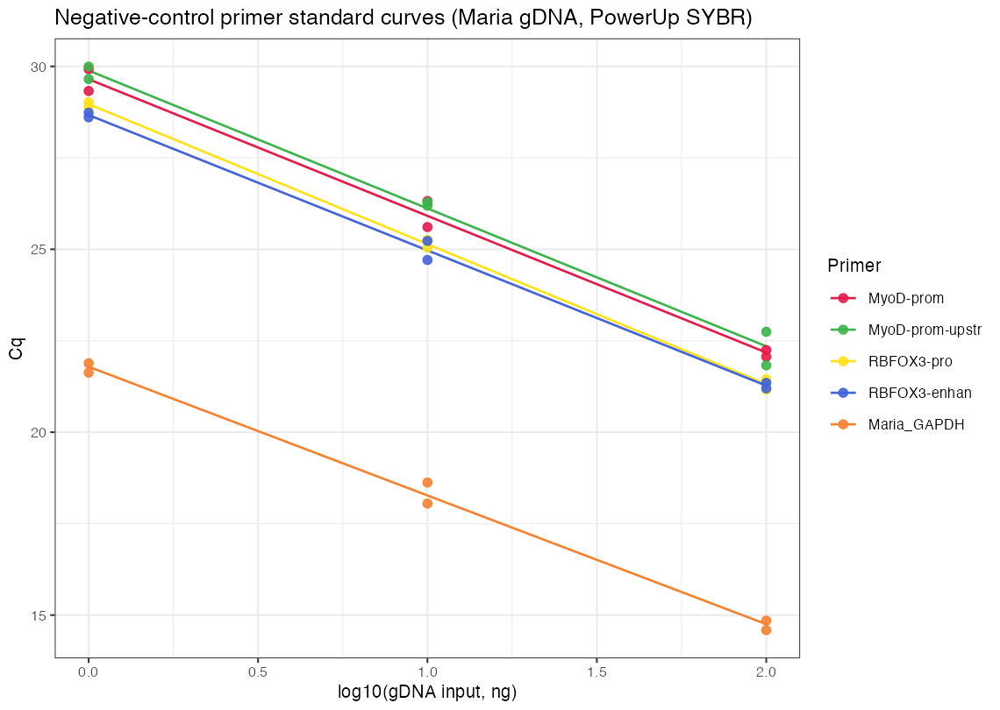

# Goal

Characterize the qPCR amplification efficiency and melt behavior of the four **negative-control (NC) primer pairs** selected on 2026-07-16 for the ATAC-qPCR workflow — **MyoD_promoter**, **MyoD_promoter_upstream**, **RBFOX3_promoter**, **RBFOX3_enhancer** — before using them as background/floor controls.

This is an exploratory QC run to see how each pair titrates on clean reference gDNA; no fixed pass/fail cutoff is applied. Typical reference values (~90–110% efficiency, R² near 1, single melt peak) are used only as interpretation context. **Maria_GAPDH** — the reference primer pair from the 2026-07-16 PC-efficiency run — is included on the same plate as a plate-level anchor.

---

# Protocol

- **Conditions:** n = 2 technical replicates per target per input level; three-point titration **1 / 10 / 100 ng** (log₁₀ 0/1/2).
- **Targets (4 NC candidates):** MyoD_promoter, MyoD_promoter_upstream, RBFOX3_promoter, RBFOX3_enhancer; plus **Maria_GAPDH** (reference/anchor, same pair as the 2026-07-16 PC run).
- **Template:** Maria's reference gDNA (same clean template used in the 2026-07-16 PC-efficiency run).
- **Chemistry:** PowerUp SYBR Green Master Mix (2×), 20 µL reactions — 2 µL template + 2 µL primer + 10 µL 2× PowerUp + 6 µL water. _(Note: PowerUp here, not the iTaq SYBR used on the PC-efficiency plate.)_

**NC primer sequences** (from 2026-07-16 selection, mm10):

| Target                 | Forward                | Reverse              |
| ---------------------- | ---------------------- | -------------------- |
| MyoD_promoter          | AACTCCTATGCTTTGCCTGGT  | TGTCTACTCCTCCAGCCTGT |
| MyoD_promoter_upstream | AGAAGAATGGTGGCTCTCAGTC | CAGGACTGTGCTTGACTGCT |
| RBFOX3_promoter        | GCGAGCCAGCTGAATGTG     | GGGTGCCCTACAAGTCTCAC |
| RBFOX3_enhancer        | AATTCTGCTCCTTCGGCCTG   | ATATTCGGCTGCAGGACTCG |

**Plate layout.** Rows set gDNA input (A/B/C = 1/10/100 ng), two wells per target (technical duplicate). NC candidates in cols 1–2 / 4–5 / 7–8 / 10–11 of rows A–C; Maria_GAPDH anchor block in rows E–G, cols 1–2.

| Input (row) | Col 1–2       | Col 4–5                | Col 7–8         | Col 10–11       |
| ----------- | ------------- | ---------------------- | --------------- | --------------- |
| 1 ng (A)    | MyoD_promoter | MyoD_promoter_upstream | RBFOX3_promoter | RBFOX3_enhancer |
| 10 ng (B)   | MyoD_promoter | MyoD_promoter_upstream | RBFOX3_promoter | RBFOX3_enhancer |
| 100 ng (C)  | MyoD_promoter | MyoD_promoter_upstream | RBFOX3_promoter | RBFOX3_enhancer |

Reference anchor (rows E/F/G = 1/10/100 ng), cols 1–2: **Maria_GAPDH**.

**No no-template control (NTC) was included on this plate.**

**Readout.** CFX Maestro Cq export + melt. Standard curve fitted per target as Cq vs log₁₀(input); efficiency E = 10^(−1/slope) − 1.

---

# Results

- **All four NC primers titrate cleanly.** Efficiencies span **82.5–86.3%**, all curves tightly linear (R² 0.99–1.00), with small technical-replicate spread (Cq SD ≤ 0.65, mostly < 0.5).
- **RBFOX3-enhan (86.3%)** and **MyoD-prom (85.2%)** are the strongest; **MyoD-prom-upstr (84.2%)** and **RBFOX3-pro (82.5%)** are close behind.
- The **Maria_GAPDH anchor read 92.4%** on this plate — vs **100.4%** on the 2026-07-16 iTaq PC plate. The anchor running ~8 points lower is consistent with the **PowerUp-vs-iTaq chemistry switch** rather than a template problem, so the four NC absolute efficiencies here are likely a slight underestimate; **relative to the anchor all four sit at ~89–93% of reference performance** — well within usable range.
- Maria_GAPDH is ~7–8 Cq earlier than the NC targets at matched input (high-copy locus); the NC Cq values (~29–30 at 1 ng, ~21–22 at 100 ng) are appropriate for single-copy genomic loci.
- **Melt Tm was only sparsely captured** this run (most wells exported `None`): RBFOX3-pro ≈ 85 °C and RBFOX3-enhan ≈ 83 °C gave consistent single peaks, MyoD-prom-upstr one well ≈ 80.5 °C, MyoD-prom none recorded. Specificity therefore cannot be fully confirmed from melt for every pair here — see Note.

**Standard curves — Cq vs log₁₀ gDNA input**

**Amplification efficiency** (linear fit Cq vs log₁₀ input):

| Target                | slope  | R²    | Efficiency | Melt Tm    |
| --------------------- | ------ | ----- | ---------- | ---------- |
| RBFOX3-enhan          | −3.699 | 0.997 | **86.3%**  | 83.0 °C    |
| MyoD-prom             | −3.736 | 0.992 | **85.2%**  | n/r        |
| MyoD-prom-upstr       | −3.769 | 0.991 | **84.2%**  | 80.5 °C\*  |
| RBFOX3-pro            | −3.828 | 0.999 | **82.5%**  | 85.0 °C    |
| Maria_GAPDH (ref)     | −3.519 | 0.995 | **92.4%**  | n/r        |

\* melt recorded for only a subset of wells this run; n/r = not recorded.

**Cq** (2 technical replicates per target per input; SD = sample standard deviation of the two replicates):

| Target          | Input  | Cq rep1 | Cq rep2 | Mean Cq | Cq SD |
| --------------- | ------ | ------- | ------- | ------- | ----- |
| MyoD-prom       | 1 ng   | 29.92   | 29.33   | 29.63   | 0.42  |
| MyoD-prom       | 10 ng  | 26.32   | 25.61   | 25.96   | 0.50  |
| MyoD-prom       | 100 ng | 22.06   | 22.25   | 22.15   | 0.13  |
| MyoD-prom-upstr | 1 ng   | 30.00   | 29.65   | 29.83   | 0.24  |
| MyoD-prom-upstr | 10 ng  | 26.29   | 26.19   | 26.24   | 0.07  |
| MyoD-prom-upstr | 100 ng | 22.75   | 21.83   | 22.29   | 0.65  |
| RBFOX3-pro      | 1 ng   | 29.02   | 28.91   | 28.97   | 0.08  |
| RBFOX3-pro      | 10 ng  | 25.26   | 25.05   | 25.15   | 0.15  |
| RBFOX3-pro      | 100 ng | 21.16   | 21.45   | 21.31   | 0.20  |
| RBFOX3-enhan    | 1 ng   | 28.61   | 28.74   | 28.67   | 0.09  |
| RBFOX3-enhan    | 10 ng  | 24.71   | 25.23   | 24.97   | 0.37  |
| RBFOX3-enhan    | 100 ng | 21.35   | 21.20   | 21.27   | 0.11  |
| Maria_GAPDH     | 1 ng   | 21.88   | 21.63   | 21.76   | 0.18  |
| Maria_GAPDH     | 10 ng  | 18.62   | 18.05   | 18.34   | 0.41  |
| Maria_GAPDH     | 100 ng | 14.59   | 14.85   | 14.72   | 0.20  |

Analysis: `standard_curves_20260722.R` → `standard_curves_20260722.png` / `.pdf`, `efficiency_table_20260722.csv`.

---

# Note

All four NC primer pairs are usable as background/floor controls for the ATAC-qPCR workflow: they titrate linearly over two orders of magnitude (R² ≥ 0.99), efficiencies cluster in a tight 82–86% band, and technical replicates are close. The spread between the four is small enough that primer choice can be driven by locus preference rather than efficiency.

**Interpreting the absolute efficiencies.** The plate anchor Maria_GAPDH read 92.4% here vs 100.4% on the 2026-07-16 iTaq plate. Because the same reference template and pair dropped ~8 points, the most likely cause is the **PowerUp vs iTaq master-mix switch**, not the NC primers or template. Read relative to the anchor, the four NC pairs are ~89–93% of reference — i.e. genuinely efficient. Absolute cross-plate comparison with the iTaq PC run should be done with this offset in mind.

**Caveats / next steps.**

- **Melt data incomplete.** Most wells exported `None` for melt this run, so single-peak specificity is only confirmed for the RBFOX3 pairs (and partially MyoD-prom-upstr). Re-run the melt/dissociation export from the .pcrd, or repeat with melt captured, to formally confirm specificity for MyoD-prom especially.
- **No NTC.** Without a no-template control, primer-dimer/contamination can't be formally excluded — more important here than for the high-signal PCs, since NC primers act as the assay floor. Add one NTC per primer before locking the panel.
