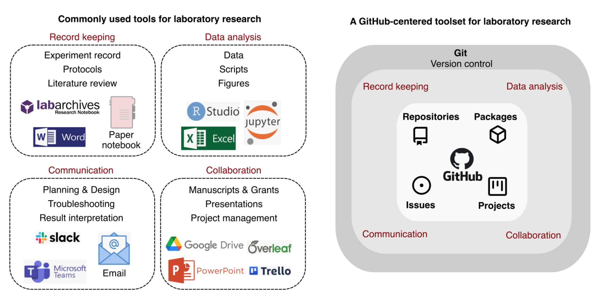

## Lets think about....

::: {.callout-note}
## What should we value an ELN?
:::

-  Easy-to-archive

-  Easy read and Easy write

-  Flexibility --- We all have different way to handle our missions!

::: {.callout-note}
## What should we pursue as a researcher?
:::
- Reproducibility -- ex. Documentation

- Collaborative -- ex. Data share to 

- Robust workflow -- Daily routine 

::: {.callout-caution}
## Caution
We are vulnerable, fragile but busy 
:::

## What we have been using

:::{.column width="40%"}

**Google Docs, Dropbox and OpenBis**  

**a.k.a Cloud-based tools**

::: {.callout-tip}
## Good
- Easy to share
- Intuitive (User friendly)
- Globally used
:::

::: {.callout-warning}
## Lack of 
- Structured way to track change (version control)
:::
:::

:::{.column width="10%"}
:::

:::{.column width="40%"}

**Slack, Microsoft Teams**

**a.k.a Messaging tools** 

::: {.callout-tip}
## Good
- Facilitate informal discussion
- Easy for file exchange
:::

::: {.callout-warning}
## Lack of 
- poor organized format
- unreproducible
:::
:::

## Fragmented research tool {transition="convex"}
 [^1]

[^1]: Chen, K. Y., Toro-Moreno, M., & Subramaniam, A. R. (2024). GitHub is an effective platform for collaborative and reproducible laboratory research. arXiv. https://arxiv.org/abs/2408.09344

## Here is Git and GitHub! 
### This is All-in-one package

- version tracking

- Universal file formats

- Collaboration

- etc... 

::: {.callout-warning}
## However
We need a bit of training
:::

# What? and How? 

## What is GitHub??

(Here plz demonstrate what is Git and GitHub)

## So How?? {background-image=prometheus.jpeg}

::: {.callout-note}
## OKay! i know what they are! 
But HOW?
:::

1. Setup GitHub
down arrow (plz help me to add)
2. Create own repository
down arrow (plz help me to add)
3. clone to local
down arrow (plz help me to add)
4. Edit files 
down arrow (plz help me to add)
5. stage and commit changes
down arrow (plz help me to add)

::: {.callout-important}
## Important
During Whole process what you need to command are:
git init
git add .
git commit -m “[descriptive message]”
git log

git remote add origin [url]
git push origin [branch]

:::

